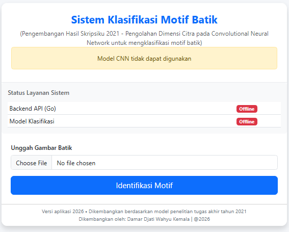
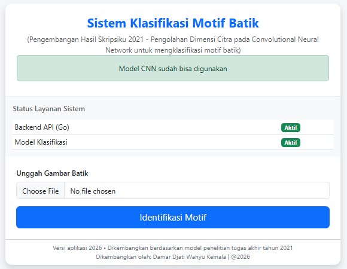
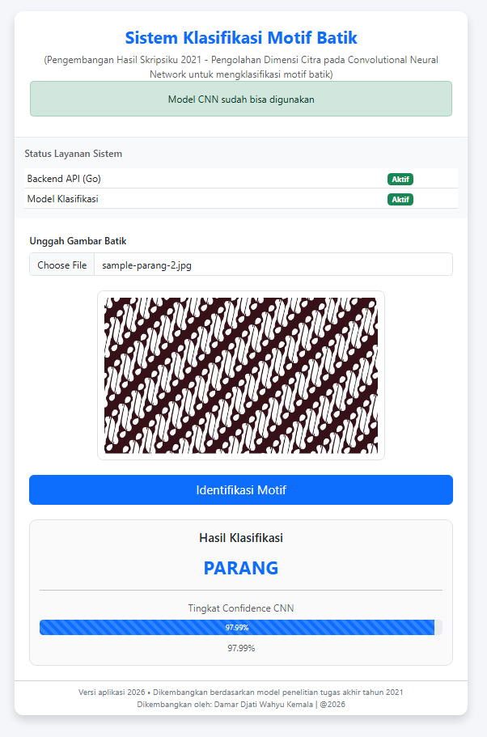
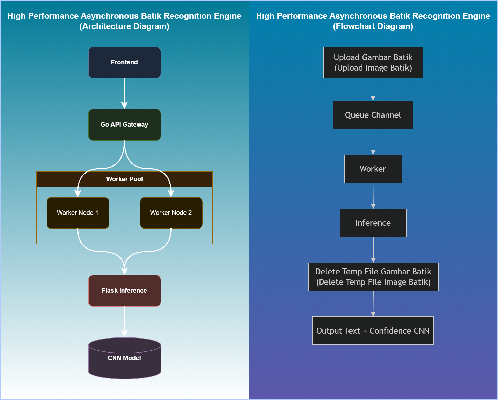

# High Performance Asynchronous Batik Recognition Engine

Sistem klasifikasi motif batik berbasis Convolutional Neural Network (CNN) yang digunakan untuk mengidentifikasi tiga motif batik Indonesia, yaitu **Kawung**, **Megamendung**, dan **Parang**.

Proyek ini merupakan pengembangan lanjutan dari penelitian skripsi Strata-1 (S1) yang diselesaikan pada tahun 2021 dengan judul:

> **"Pengolahan Dimensi Citra pada Convolutional Neural Network untuk mengklasifikasi motif batik"

Fokus pada pembangunan dan evaluasi model klasifikasi citra menggunakan TensorFlow dan Keras dalam lingkungan eksperimen Google Colaboratory.

Pada tahun 2026, penelitian tersebut dikembangkan lebih lanjut menjadi sebuah aplikasi berbasis layanan (*service-oriented application*) dengan pemisahan antara komponen Machine Learning dan komponen Backend API.

Pengembangan lanjutan ini bertujuan untuk mengimplementasikan model yang telah dilatih ke dalam sebuah sistem yang lebih mendekati kebutuhan dunia nyata, dengan mempertimbangkan aspek pemrosesan antrean, pemisahan layanan, dan kemampuan menangani beberapa permintaan pengguna secara bersamaan.

---

## Arsitektur Sistem

Sistem terdiri atas tiga komponen utama:

### Frontend

Antarmuka berbasis HTML, Bootstrap, dan JavaScript yang digunakan untuk mengunggah citra batik serta menampilkan hasil klasifikasi.

### Backend API (Go)

Berfungsi sebagai gerbang layanan (*API Gateway*) yang menerima unggahan gambar, mengelola antrean pekerjaan, dan mendistribusikan proses inferensi ke worker yang tersedia.

### Inference Service (Python)

Layanan Flask yang bertanggung jawab menjalankan model CNN dan menghasilkan prediksi motif batik beserta nilai kepercayaannya (*confidence score*).

---

## Fitur Utama

### Klasifikasi Motif Batik

Sistem mampu mengidentifikasi tiga kelas motif:

- Kawung
- Megamendung
- Parang

### Asynchronous Processing

Pemrosesan gambar dilakukan menggunakan mekanisme antrean berbasis channel dan worker pool sehingga beberapa permintaan dapat diproses secara lebih terstruktur.

### Decoupled Architecture

Layanan Backend API dan layanan Machine Learning dipisahkan menjadi dua komponen independen untuk memudahkan pengembangan dan pemeliharaan sistem.

### Service Status Monitoring

Frontend menampilkan status layanan secara real-time untuk:

- Backend API (Go)
- Model Inference Service (Python)

Status sistem digunakan untuk menentukan apakah proses klasifikasi dapat dijalankan oleh pengguna.

---

## Teknologi yang Digunakan

### Backend

- Go
- net/http
- Goroutine
- Channel
- Worker Pool Pattern

### Machine Learning

- Python
- TensorFlow
- Keras
- MobileNetV2

### Frontend

- HTML5
- Bootstrap 5
- Vanilla JavaScript

---

## Struktur Proyek

```text
high-performance-asynchronous-batik-recognition-engine
├── .gitignore
├── index.html
├── README.md
├── hasil-prediksi.png
├── menu-awal-offline.png
├── menu-awal.png
├── index.html
│
├── go_backend/
│   ├── main.go
│   ├── go.mod
│   └── go.sum
│
└── python_inference/
    ├── app.py
    ├── requirements.txt
    └── saved_model_batik/
```

---

## Mekanisme Pemrosesan

1. Pengguna mengunggah citra batik melalui antarmuka web.
2. Backend Go menerima berkas dan menyimpannya sementara.
3. Berkas dimasukkan ke dalam antrean pekerjaan (*job queue*).
4. Worker yang tersedia mengambil pekerjaan dari antrean.
5. Worker mengirim citra ke layanan Flask untuk proses inferensi.
6. Model CNN melakukan klasifikasi dan menghasilkan prediksi.
7. Hasil dikembalikan ke Backend Go.
8. Backend mengirimkan hasil klasifikasi ke antarmuka pengguna.
9. Berkas sementara dihapus setelah proses selesai.

---

## Tampilan Sistem

<div style="width: 900px; white-space: nowrap;">

  <div style="display: inline-block; width: 280px; text-align: center; margin-right: 15px; vertical-align: top;">
    <b>Menu Awal saat Backend dan Service Offline</b><br><br>
    
  </div>

  <div style="display: inline-block; width: 280px; text-align: center; margin-right: 15px; vertical-align: top;">
    <b>Menu Awal saat Backend dan Service Aktif</b><br><br>
    
  </div>

  <div style="display: inline-block; width: 280px; text-align: center; vertical-align: top;">
    <b>Hasil Prediksi pada model CNN</b><br><br>
    
  </div>

</div>

---

## Arsitektur Sistem

<table>
    <tr>
        <td colspan="99">
            
        </td>
    </tr>
</table>

---

## Menjalankan Aplikasi

### 1. Menjalankan Layanan Inferensi Python

Masuk ke direktori:

```bash
cd python_inference
```

Install dependensi:

```bash
pip install -r requirements.txt
```

Jalankan layanan:

```bash
python app.py
```

Secara default layanan akan berjalan pada:

```text
http://localhost:5005
```

---

### 2. Menjalankan Backend Go

Masuk ke direktori backend:

```bash
cd go_backend
```

Jalankan aplikasi:

```bash
go run .
```

Backend API akan tersedia pada:

```text
http://localhost:8080
```

---

### 3. Menjalankan Frontend

Buka berkas:

```text
index.html
```

menggunakan browser modern.

Pastikan layanan Python dan Backend Go telah berjalan sebelum melakukan proses klasifikasi.

---

## Catatan Pengembangan

Repositori ini merupakan pengembangan lanjutan dari penelitian skripsi Strata-1 (S1) klasifikasi motif batik yang diselesaikan pada tahun 2021 dengan judul: 

> **"Pengolahan Dimensi Citra pada Convolutional Neural Network untuk mengklasifikasi motif batik"**

Fokus penelitian awal berada pada pembangunan dan evaluasi model CNN untuk pengenalan motif batik.

Pada tahun 2026, penelitian tersebut dikembangkan menjadi sebuah sistem aplikasi sederhana berbasis layanan dengan tujuan untuk mengeksplorasi proses integrasi model Machine Learning ke dalam arsitektur perangkat lunak yang lebih terstruktur.

Pengembangan ini dilakukan sebagai bentuk implementasi lanjutan terhadap model yang telah dihasilkan pada penelitian sebelumnya, tanpa mengubah tujuan utama penelitian awal.

---

**Proyek ini dikembangkan untuk tujuan akademik, penelitian, dan pembelajaran implementasi Machine Learning pada sistem perangkat lunak.**

## Copyright Personal Portfolio
* **Project Owner / Created By:** Damar Djati Wahyu Kemala
* **Study:** Rest=API dan Pengujian Model CNN dengan tools Go dan Python
* **Date Created:** Juni 2026
* **GitHub Portfolio:** [https://github.com/dams-code](https://github.com/dams-code)

---
*© 2026 Damar Djati Wahyu Kemala.
Originally derived from a batik motif classification study conducted in 2021 and further developed into a production-oriented prototype in 2026, this project showcases the integration of Go concurrency patterns, asynchronous processing, and deep learning inference services.<br/>
This repository is provided for educational and portfolio purposes. Commercial use, redistribution, or modification of this work requires prior written permission from the author.*